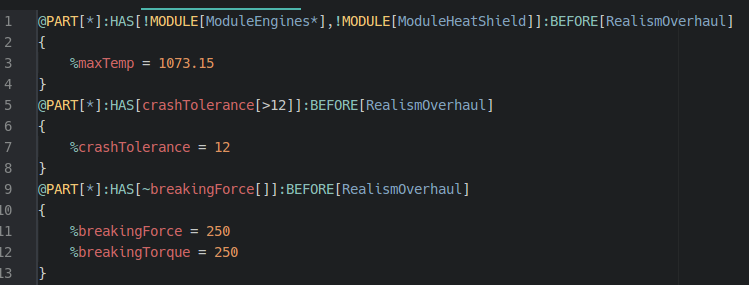

# Grammar for Kerbal Space Program config files

This is for editing KSP part cfgs, save files, and craft files.

There is reasonable support for Module Manager files, as seen in the screenshot.

Still lacking proper indentation/folding support.

A whole lot of inspiration drawn from [Nathan Jang's SublimeText plugin](https://github.com/NathanJang/KSP-tmLanguage).

