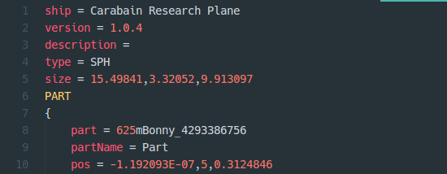

# Grammar for Kerbal Space Program config files

This is for editing KSP part cfgs, save files, and craft files. It's quite rough as yet.

Some matchers and a whole lot of inspiration drawn from [Nathan Jang's SublimeText plugin](https://github.com/NathanJang/KSP-tmLanguage).

This plugin is licensed under the [MIT license](https://opensource.org/licenses/MIT), copyright 2015 Gert Sønderby.

